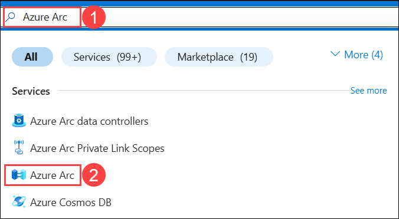
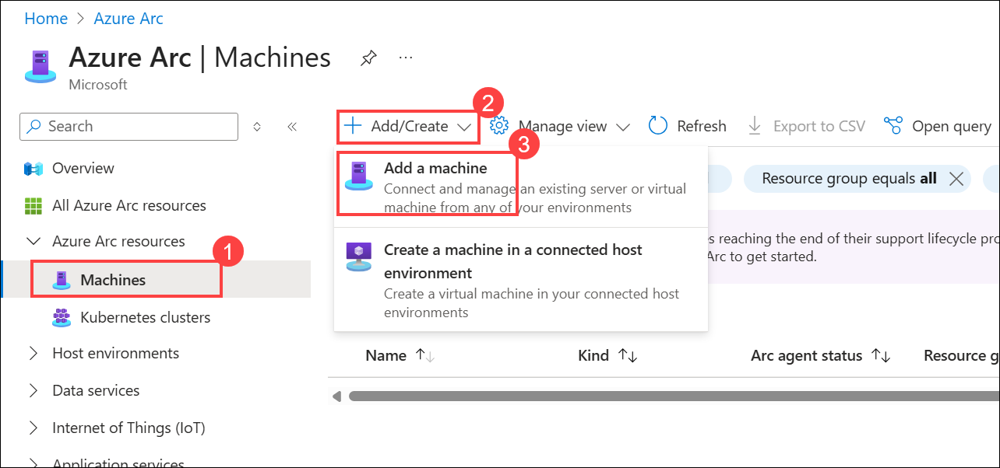
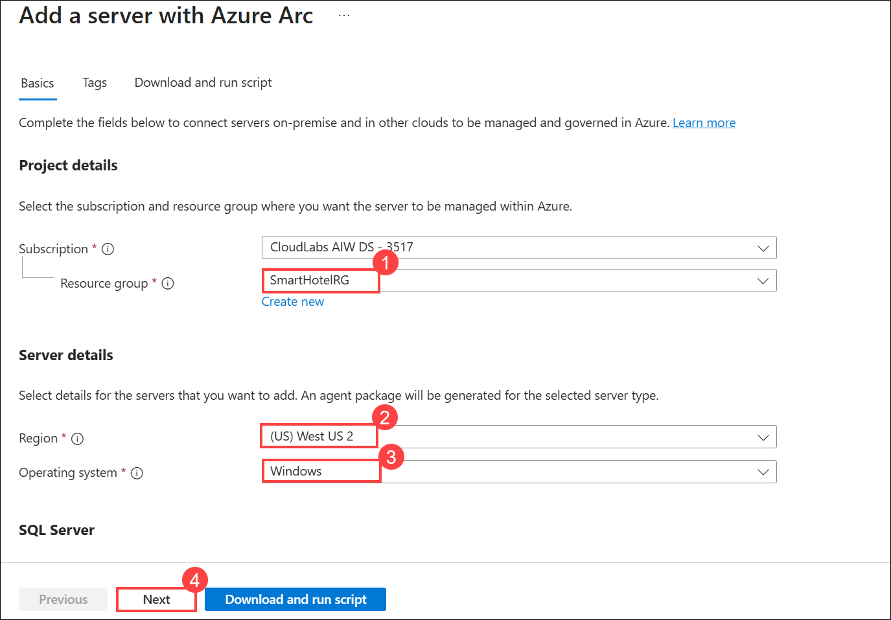
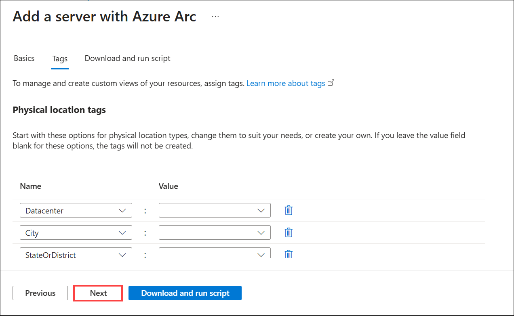
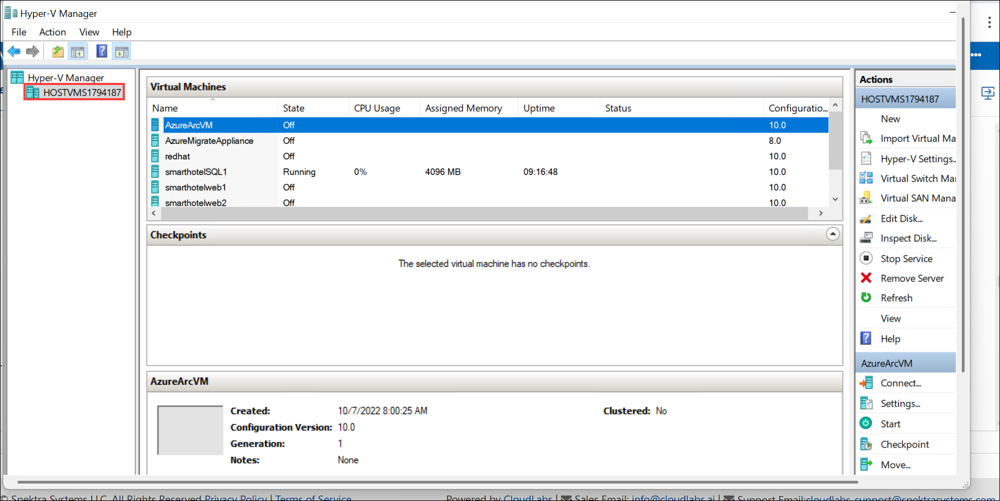
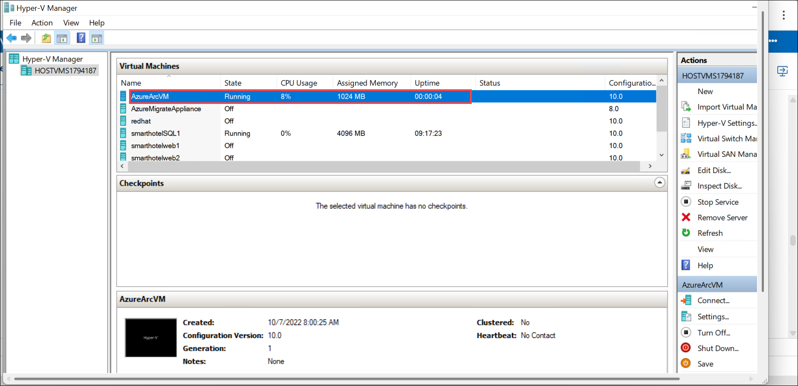
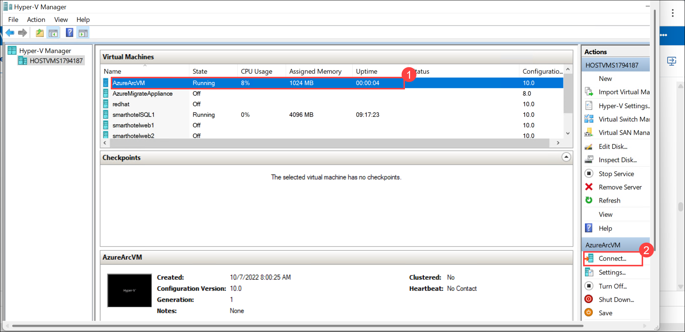
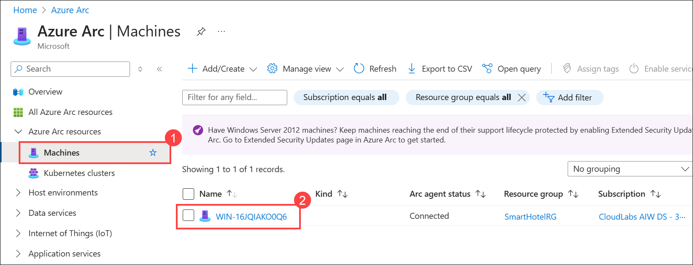

# HOL3: Onboard On-premises servers to Azure Arc-Enabled Server


### Estimated Duration: 30 Minutes

In this HOL, you will use Azure Migrate: Discovery and assessment tool that describes how to onboard on-premises Hyper-V VMs to Azure Arc for Azure Management.

Azure Arc allows you to manage your hybrid IT estate with a single pane of glass by extending the Azure management experience to your on-premises servers, which are not ideal candidates for migration.

## Lab Objectives

In this HOL, you will complete the following exercises:

- Exercise 1: Run workloads anywhere with Azure cloud services
- Exercise 2: Configure ASR for On-premises Infrastructure
- Exercise 3: Setup Test Failover
- Exercise 4: Failover the Infrastructure to Azure Cloud
- Exercise 5: Enable Microsoft Defender for Cloud, Microsoft Sentinel, Azure Monitor, and setup Log Analytics for each resource.
- Exercise 6: Business Case Analysis Capability (Read-only)

### Exercise 1: Run workloads anywhere with Azure Cloud Services

In this exercise, you will deploy and configure the Azure Connected Machine agent on a Windows machine hosted outside of Azure, to ensure that it can be managed through Azure Arc-enabled servers.

1. If you are not logged in already, click on the Azure portal shortcut that is available on the desktop and log in with below Azure credentials.
    * Azure Username/Email: <inject key="AzureAdUserEmail"></inject> 
    * Azure Password: <inject key="AzureAdUserPassword"></inject>

1. In the search bar of the Azure portal, type **Azure arc (1)** and select **Azure Arc (2)** from suggestions under Services, as shown below:
   
    
  
1. On the **Azure Arc** page, select **Machines (1)** under **Azure Arc Resources** from left pane, click on **+Add/Create (2)**, then **Add a Machine (3)**.
    
    
    
1. On the **Add servers with Azure Arc** page, then click **Generate script** under Add a single server.

    
    
1. In the **Basics** section, add the following details:
     
   - Subscription: **Select your subscription**
    
   - Resource group: **SmartHotelRG (1)**
  
   - Region: Select **<inject key="Region" enableCopy="false" /> (2)**
   
   - Operating system: **Windows (3)**
   
   - Leave other values as default and click on **Next (4).**

        

1. In the **Tags** section, leave the values as default and click on **Next**.

     

1. In the **Download and run script** section, click **copy (1)** icon to copy the entire script.Paste it into Notepad or your preferred text editor, as you will need it in the upcoming steps, then click on **Close (2)**.

    
    
1. Go to the **Start (1)** button in the VM, search and select **Hyper-V Manager (2)**.

    

   > **Note:** You can also open the **Hyper-V manager** by clicking on the icon that is present in the taskbar. 
    
1. In Hyper-V Manager, select **HOSTVMS<inject key="DeploymentID" enableCopy="false" />**. 
  
    

 1. In the Hyper-V Manager, select the **AzureArcVM** VM and you will see the state as **Running**.

      

    >**Note:** If you are unable to find the state for the **AzureArcVM (1)** VM as Running, then select **Start (2)** in the Actions pane on the right.

        
    
1. In Hyper-V Manager, select the **AzureArcVM (1)** VM, then select **Connect (2)** in the Actions pane on the right.

      
    
1. Under Connect to AzureArcVM, click on **Connect** and then log into the VM with the **Administrator password**: **<inject key="SmartHotel Admin Password" />** (If the copy/paste is not working in the hyper-V machine, please try typing the password. The login screen may pick up your local keyboard mapping, use the 'eyeball' icon to check).
 
    
    
1. From the **Start (1)** menu of the AzureArcVM, search for **Windows Powershell (2)** and open it **(3)**.

    
      
1. In PowerShell, run the below command to set the execution policy as unrestricted.

    ```
    Set-ExecutionPolicy -ExecutionPolicy unrestricted
    ```
   >**Note:** If you get an option, "Do you want to change the execution policy", please type A and press enter. 

1. Now, run the whole script that you copied in the notepad earlier in step 7.

1. After running the script, packages will be installed and then you will be directed to a pop-up browser page to log into your Azure account for authentication purposes. Use the below Azure credentials:

    * Azure Username/Email: **<inject key="AzureAdUserEmail"></inject>** 
    * Azure Password: **<inject key="AzureAdUserPassword"></inject>** 

   > **Note:** Move back to the PowerShell pane and now you have connected your AzureArcVM to Azure successfully.
   
   >**Note**: On the Welcome to Microsoft Edge page, select  **Start without your data**, on **Stay current with your browsing data** select **Confirm and continue** and on the help for importing Google browsing data page, select the  **Continue without this data**  button. Then, proceed to select  **Confirm and start browsing**  on the next page has a context menu.
    
    
     
 1. Close the AzureArcVM, navigate to **Azure Arc** page in the Azure portal, select **Machines (1)** under **Azure Arc resources** and now verify that a server is connected successfully **(2)**.

    >**Note:** The name of the new server added could be different. You should refresh to see the new server.
    
    
     
    > **Congratulations** on completing the task! Now, it's time to validate it. Here are the steps:
    > - Hit the Inline Validate button for the corresponding task. If you receive a success message, you can proceed to the next task. 
    > - If not, carefully read the error message and retry the step, following the instructions in the lab guide.
    > - If you need any assistance, please contact us at cloudlabs-support@spektrasystems.com. We are available 24/7 to help.
   
    <validation step="6e1ec638-e544-477f-90cc-ed27166b2f4e" />
    
### Summary

In this exercise, you explored how to deploy and configure the Azure Connected Machine agent on a Windows machine hosted outside of Azure. You learnt about creating Azure Arc-enabled servers so that they can manage the Windows machine.

Click on **Next >>** from the lower right corner to move on to the next page.
 
  