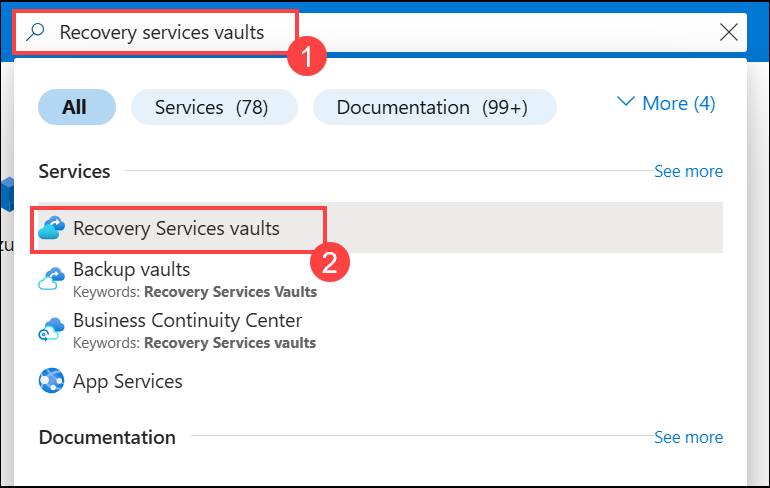
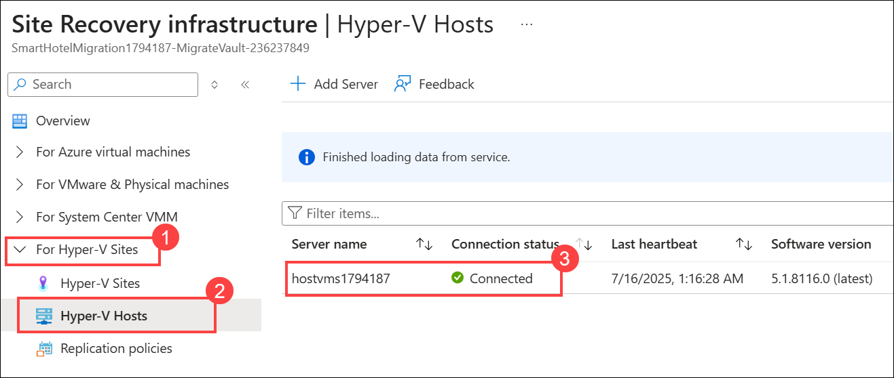
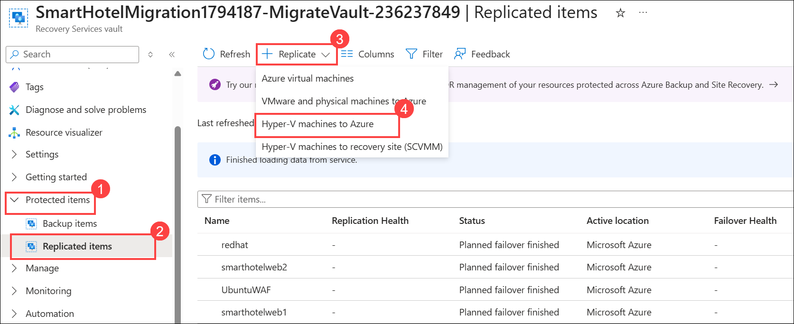
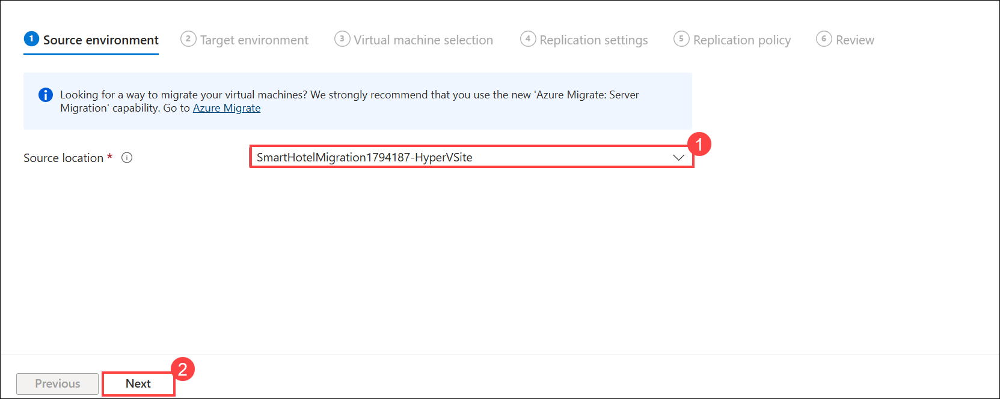
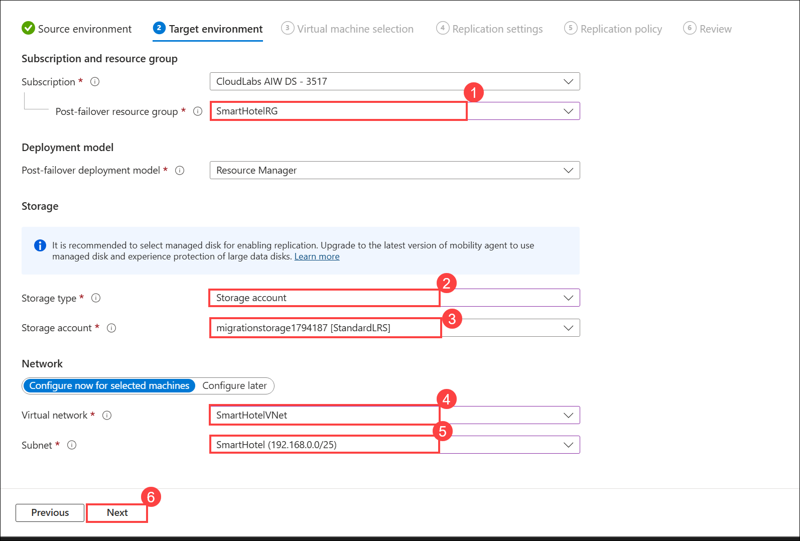
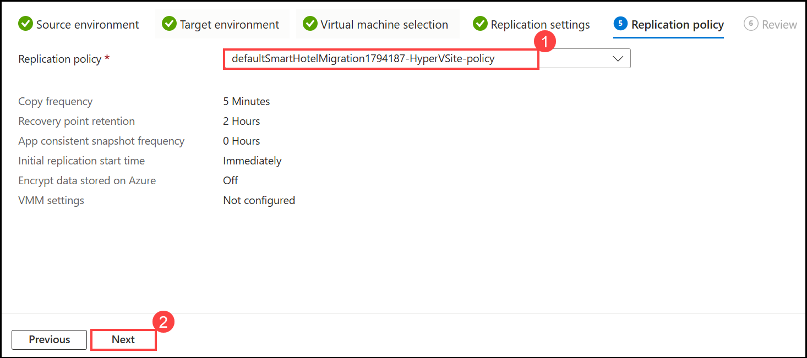

# HOL3: Exercise 2: Configure ASR for On-premises Infrastructure

### Estimated time: 30 Minutes

In this exercise, you will deploy disaster recovery of an on-premises Hyper-V VM to Azure. The Azure Site Recovery service contributes to your disaster-recovery strategy by managing and orchestrating replication, failover, and failback of on-premises machines. As part of the registration process, you will deploy the Azure Site Recovery Provider on your Hyper-V host.

## Lab objectives

In this exercise, you will complete the following task:

- Task 1: Configure ASR to on-premises infrastructure

## Task 1: Configure ASR to on-premises infrastructure

1. In the **search resources, services and docs bar**, type **Recovery services vaults (1)**. From the dropdown results under **Services**, click on **Recovery Services vaults (2)**.
   
    
    
1. On the Recovery services vaults, click on **SmartHotelMigration<inject key="DeploymentID" enableCopy="false" />-MigrateVault** which we have configured in the previous HOL1 task.
   
    

1. In the **Recovery Services vault** page, on the left panel, scroll down and click **Manage (1)** to expand the options. Under **Manage**, select **Site Recovery infrastructure (2)**.

    

1. In the **Site Recovery infrastructure** blade, expand **For Hyper-V Sites (1)** on the left menu. Click on **Hyper-V Hosts (2)**. In the list of hosts, locate your server and ensure its **Connection status** is **Connected (3)**.

    

1. Go back to your **Recovery service vault page**, expand the **Protected items (1)** section on the left panel, click **Replicated Items (2)**. Click the **+ Replicate (3)** button at the top. From the dropdown menu, select **Hyper-V machines to Azure (4)**

    
   
1. In the **Source environment** tab of the replication wizard, select **SmartHotelMigration<inject key="DeploymentID" enableCopy="false" />-HyperVSite (1)** from the **Source location** dropdown and then click on **Next (2)**.
 
    
   
1. On **Enable replication** page, under the **Target environment** tab, fill in the following details:

   - Post-failover resource group: **SmartHotelRG (1)**
   
   - Storage type: **Storage account (2)**

   - Storage account: select the storage account created in the previous HOL **migrationstorage<inject key="DeploymentID" enableCopy="false" /> (3)** available in the drop-down list.   
   
   - Virtual network: **SmartHotelVNet (4)**

   - Subnet: **SmartHotel (5)**
   
   - Leave other values as default and click on **Next (6)**
   
       
    
1. In the **Virtual machine selection** tab, check the box next to **AzureArcVM (1)** and click on **Next (2)** to proceed.

    

1. In the **Replication settings** tab, set the **OS type** to **Windows (1)** for the virtual machine `AzureArcVM` and then click on **Next (2)**

    
     
1. In **Replication policy** tab, select **defaultSmartHotelMigration<inject key="DeploymentID" enableCopy="false" />-HyperVSite-policy (1)** from the drop-down and click on **Next (2)**.  

    
   
1. Under **Review** tab, click on **Enable Replication**.

   

1. The replication process can take **15–20 minutes** to complete. Once the Replication is completed, the status of the replicated AzureArcVM will now become **Protected (2)**.
   > **Note:** You might have to refresh **(1)** a couple of times.

      

    > **Congratulations** on completing the task! Now, it's time to validate it. Here are the steps:
    > - Hit the Inline Validate button for the corresponding task. If you receive a success message, you can proceed to the next task. 
    > - If not, carefully read the error message and retry the step, following the instructions in the lab guide.
    > - If you need any assistance, please contact us at cloudlabs-support@spektrasystems.com. We are available 24/7 to help.
  
    <validation step="a173ef6e-b637-4954-b652-309ef10b6968" />
   
### Summary 

In this exercise, you explored how to set up Azure and on-premises prerequisites and create a Recovery Services vault for Site Recovery. Then you learn how to set up the source and target replication environments and create a replication policy to enable replication for a server.

Click on **Next** from the lower right corner to move on to the next page.

