# HOL1: Exercise 4: Optimizing newly Migrated Workloads and Emphasizing commonalities across all Stacks

### Estimated time: 25 Minutes

In this exercise, you will focus on enhancing business resilience through the use of Azure Virtual Machine Scale Sets (VMSS). It involves creating and deploying a specialized virtual machine image, which is captured and stored in a gallery named "imagemigration." Additionally, a VM scale set called "migrationscaleset" is established to showcase Azure's scalability and business continuity capabilities. As part of this process, you will also enable Automanage on existing machines to streamline management and optimize performance.

## Lab objectives

In this exercise, you will complete the following tasks:

- Task 1: Using VM Scale Sets to Drive Business Resiliency
- Task 2: Azure Automanage

## Task 1: Using VM Scale Sets to Drive Business Resiliency

In this task, you will be using Azure Virtual Machine Scale Sets (VMSS) to improve business resilience by creating and deploying a specialized virtual machine image. The image is captured and stored in a gallery called imagemigration, and a VM scale set named migrationscaleset is created, demonstrating Azure's scalability and business continuity capabilities.

1. In the Azure portal's navigation pane, select **Resource groups**. From the Resource groups page, select the **SmartHotelHostRG** resource group. Select **smarthotelweb1** VM to create an image.

   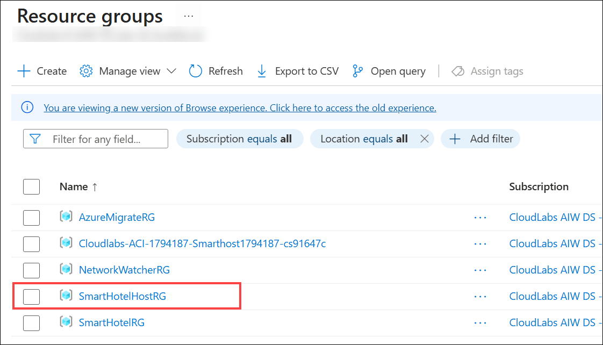

1. On the **smarthotelweb1** VM page, on the upper menu, select **Capture (1) -> Image (2)**.
   
   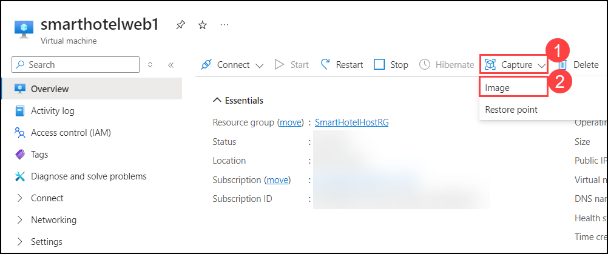

1. On the **Create an image** page, on the **Basics** tab under the **Instance details** section, select: **Yes, share it to a gallery as a VM image version.**

   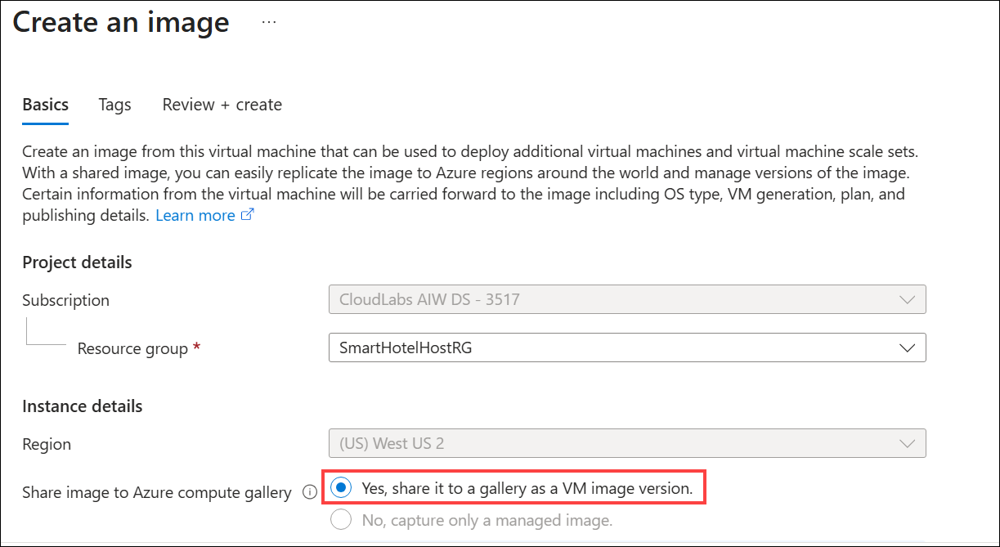

1. In the **Gallery details** section, in the **Target Azure compute gallery**, select **Create new (1)**, enter **imagemigration<inject key="DeploymentID" enableCopy="false" /> (2)**, and then click **OK (3)** to create a new Azure compute gallery.

   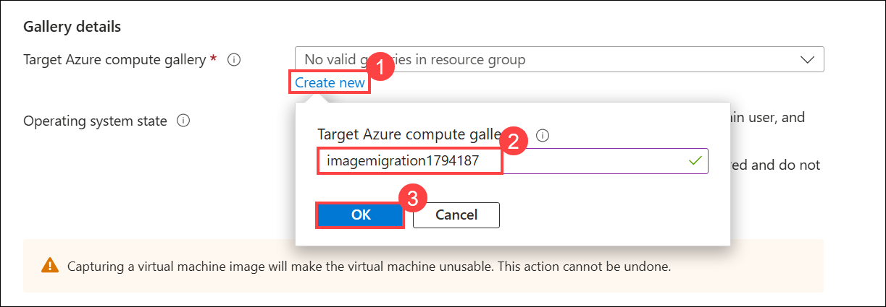

1. On the **Target VM image definition**, click **Create new (1)** and create a VM Image definition by providing the following details, and then click **Ok (6)**: 
  
   - VM image definition name: **imagedefinition<inject key="DeploymentID" enableCopy="false" /> (2)**

   - Publisher: **Microsoft (3)**
    
   - Offer: **windows (4)**
  
   - SKU: **migration (5)**

      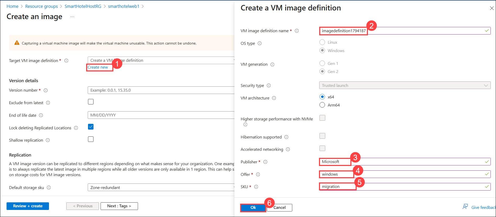

1. In the **Operating system state** section, select **Specialized (1)** and enter the **Version Number**. If this is the first version of the image, type **1.0.0 (2)**. Select **Review + create (3)**.

   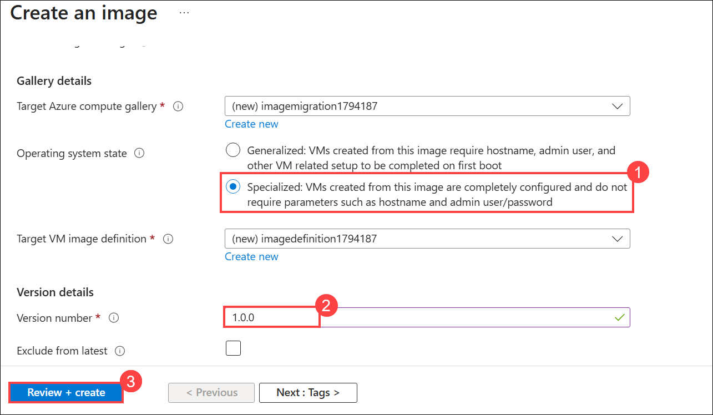

1. On the **Review + create** tab, verify that the validation has passed and all the details are correct. Then, select **Create** to begin creating the image.

    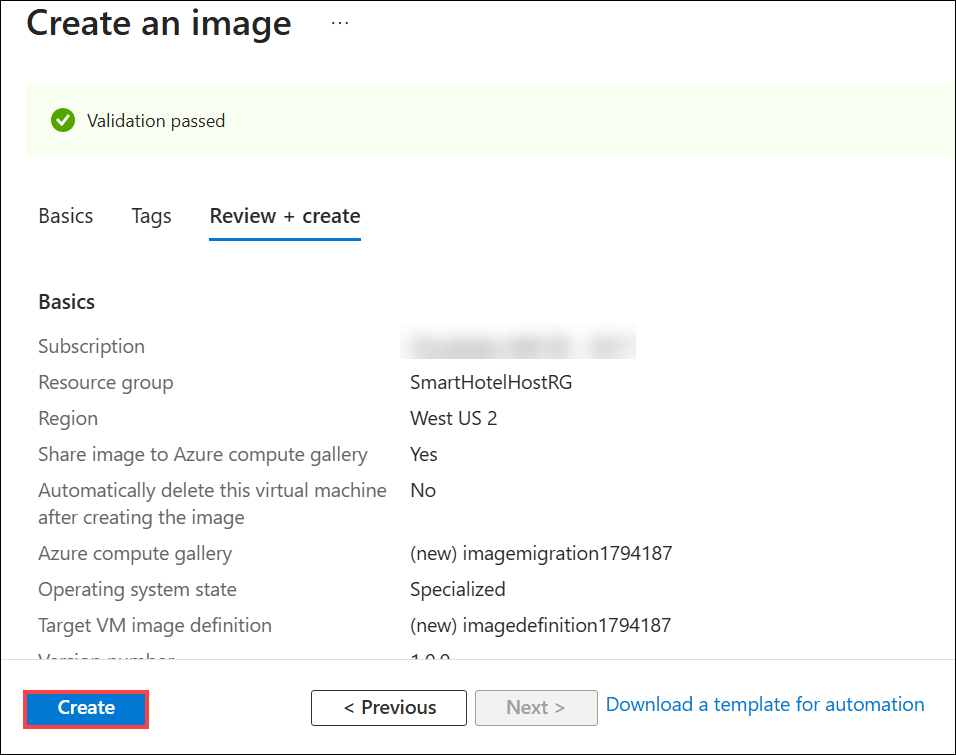

1. Once the VM image version deployment is complete, click on **Go to resource**.

   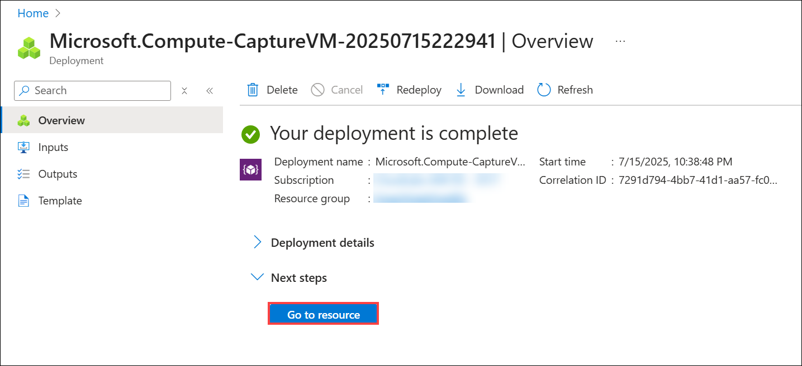
   
1. On the **VM image version** page, click **+ Create VMSS** to begin creating a Virtual Machine Scale Set using this image.

    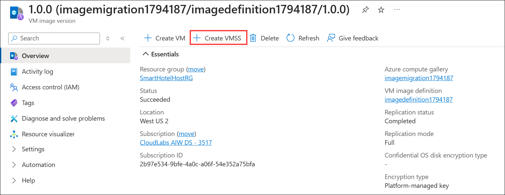

1. On the **Create a virtual machine scale set (VMSS)** page, Under the Basics tab, enter the **Virtual Machine scale set name** as **migrationscaleset<inject key="DeploymentID" enableCopy="false" />**

    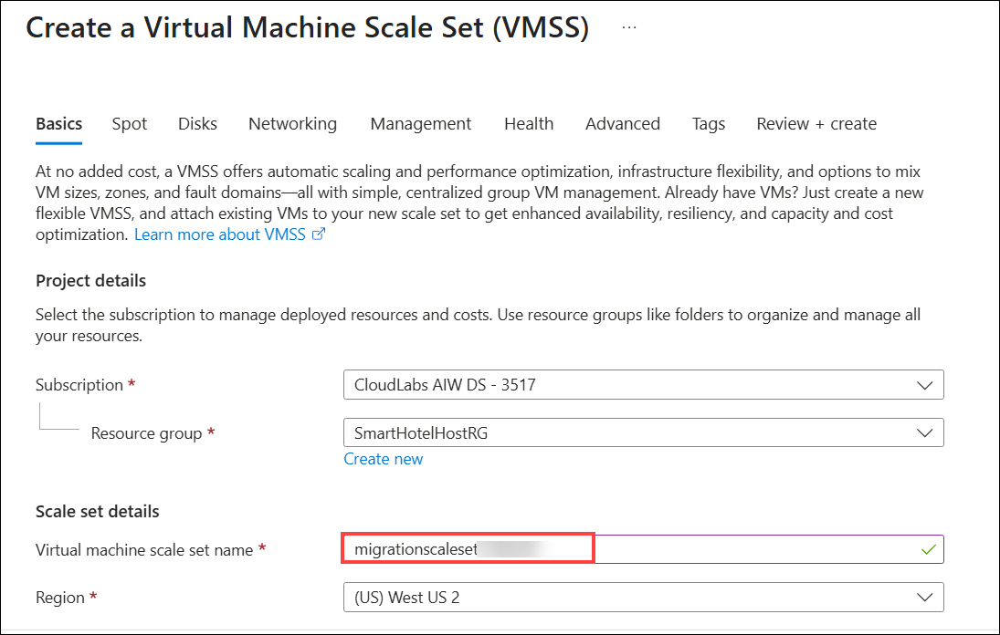

1. On the **Size** section, select **Standard_D2s_v3 (1)** as the VM size and under **Licensing**, choose **Windows server (2)** for the License type. Once done, click **Review + create (3)**.

     

1. Once validation passes, review the configuration and click **Create** to deploy the Virtual Machine Scale Set.

    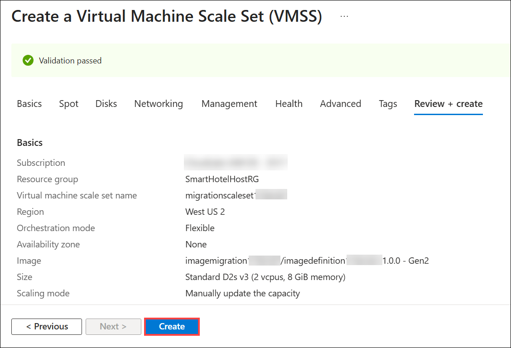

     > **Congratulations** on completing the task! Now, it's time to validate it. Here are the steps:
     > - Hit the Inline Validate button for the corresponding task. If you receive a success message, you can proceed to the next task. 
     > - If not, carefully read the error message and retry the step, following the instructions in the lab guide.
     > - If you need any assistance, please contact us at cloudlabs-support@spektrasystems.com. We are available 24/7 to help.

     <validation step="1dff74eb-dff7-4fd6-a103-04ff946cae88" />

### Task 2: Azure Automanage

In this task, you will enable Automanage on existing machines.

1. In the **Azure portal**, type **Automanage (1)** in the search bar and select **Automanage (2)** from the search results.

    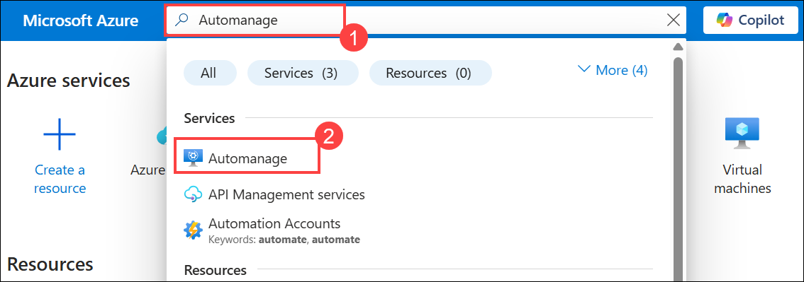

1. In the **Automanage** page, select **Automanage machines (1)** from the left menu and click **Enable on existing machine (2)**.

    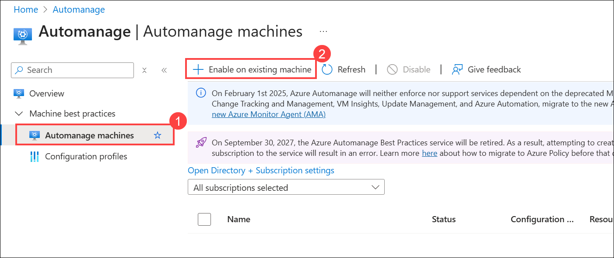

1. On the **Basics** tab, under **Configuration profile**, select your profile type: **Azure Best Practices - Production**.
   
    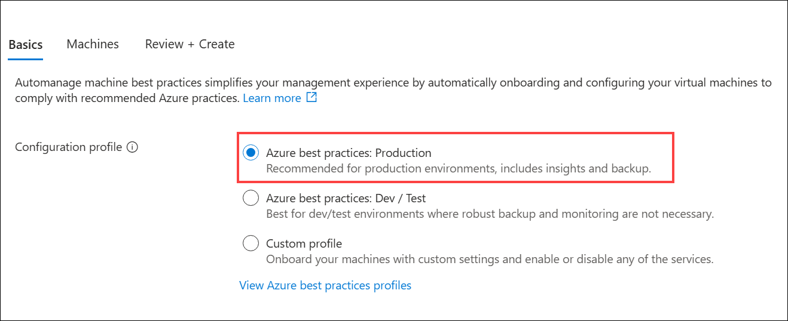
   
     > Click **View best practice profiles** to see the differences between the environments.
    
      

1. On the **Enable Automanage** page, select the following details.

     - Filter the list by your Subscription and Resource group and click on **Check eligibility on machines (1)**.
   
     - **Check the checkbox of the virtual machine (2)** you want to onboard. (for example: let's enable automanage for smarthotelweb2.)
   
     - Click on the **Review + Create (3)** button.
   
         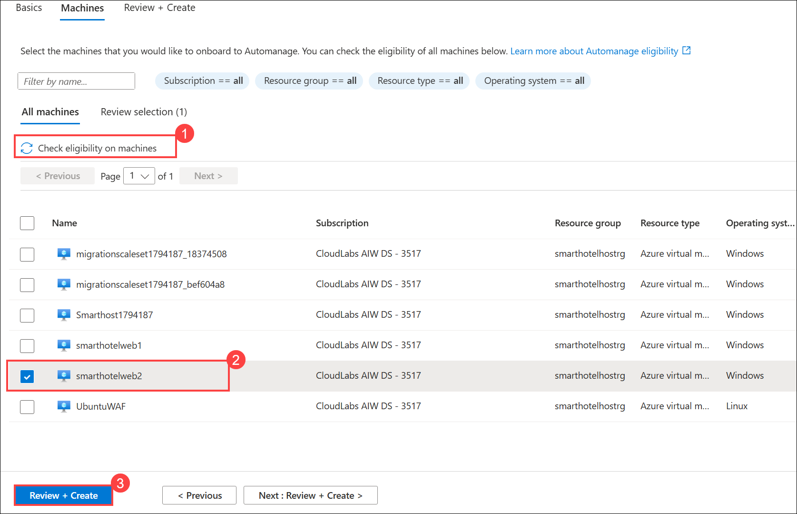

1. On the **Review + Create** tab, verify the selected configuration and click **Create** to enable Automanage.

   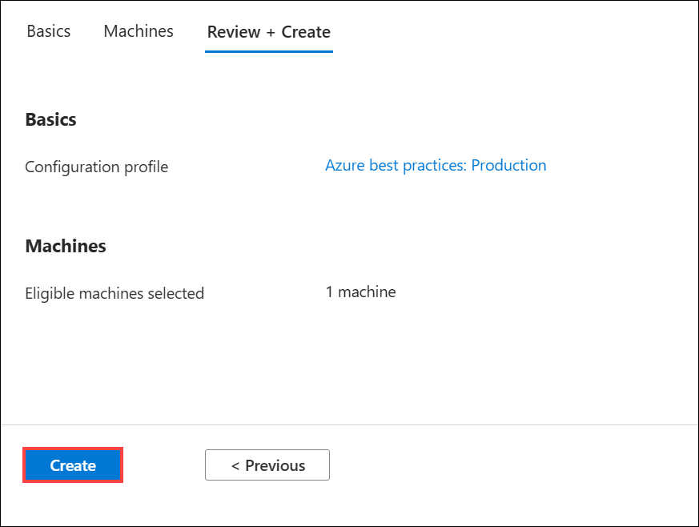

### Summary 

In this exercise, you focused on enhancing business resilience through the use of Azure Virtual Machine Scale Sets (VMSS). It involved creating and deploying a specialized virtual machine image, which was captured and stored in a gallery named "imagemigration." Additionally, a VM scale set called "migrationscaleset" was established to showcase Azure's scalability and business continuity capabilities. As part of this process, Automanage was enabled on existing machines to streamline management and optimize performance.

Click on **Next** from the lower right corner to move on to the next page.

