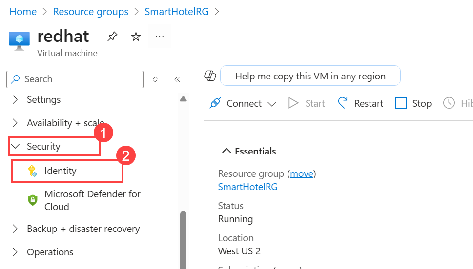
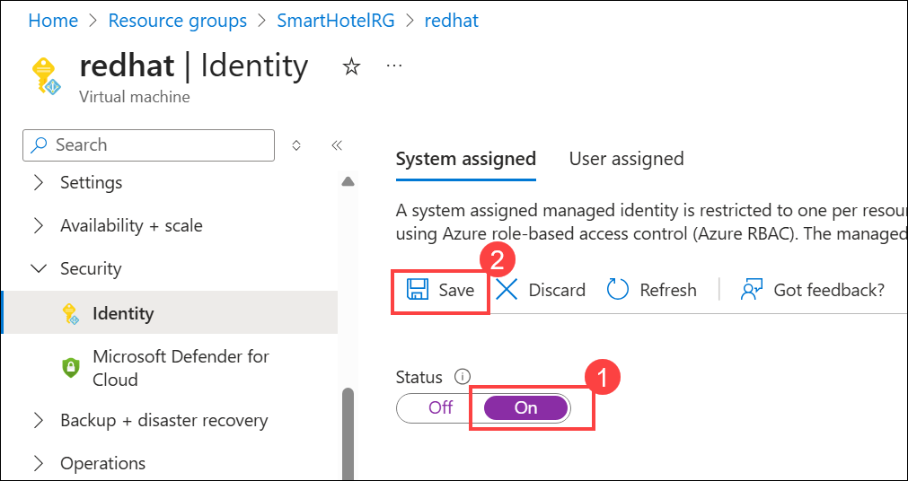
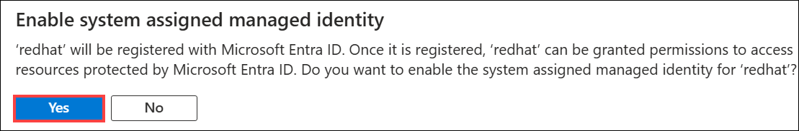
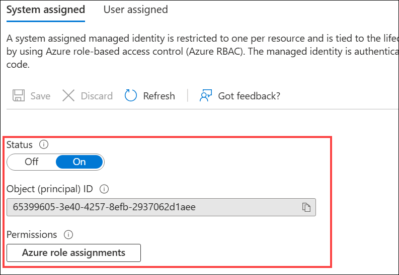
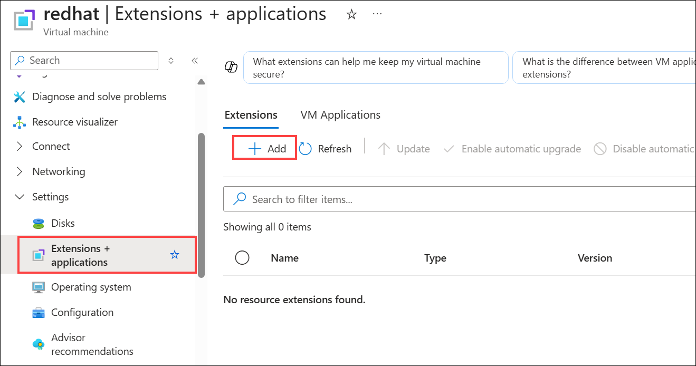
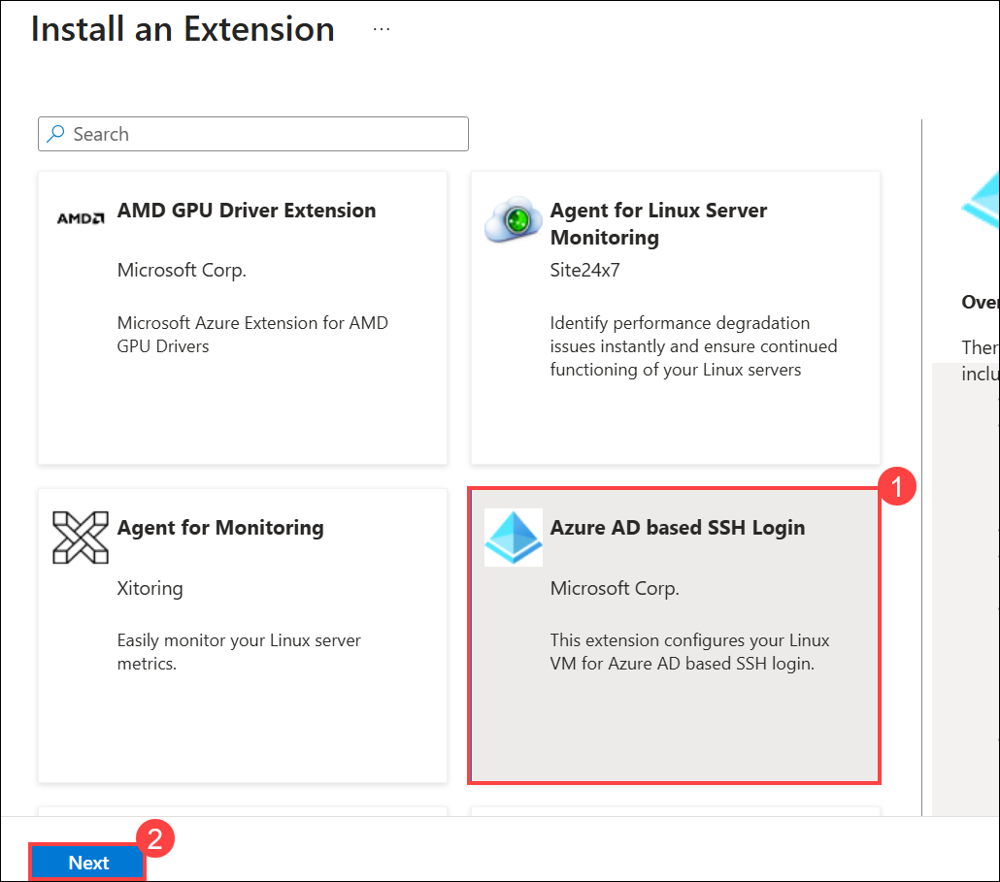
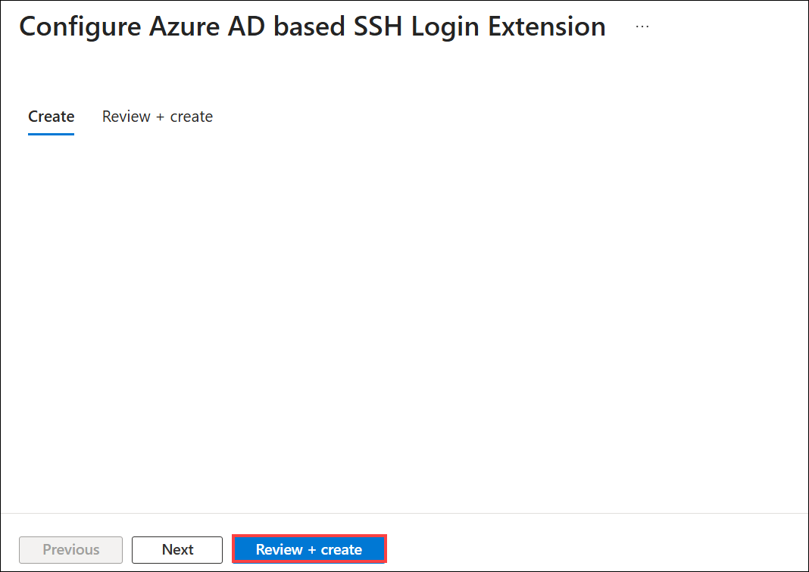
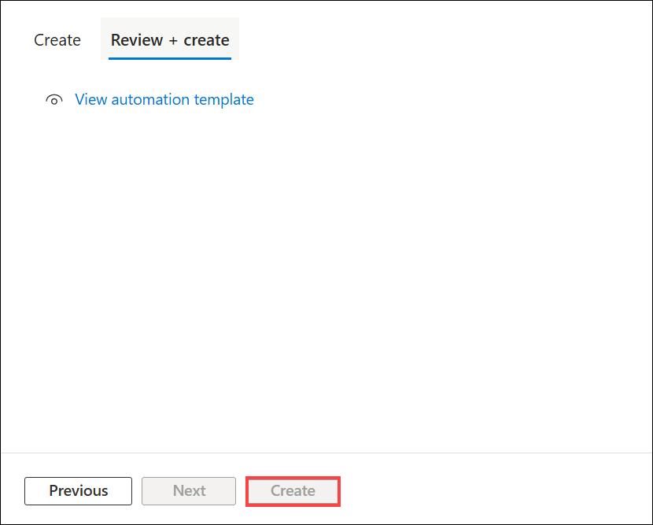

# HOL2: Exercise 4: Optimizing newly Migrated Workloads and Emphasizing commonalities across all Stacks

### Estimated time: 40 Minutes

In this exercise, you will enable the Managed Identity feature and configure Azure Active Directory (AAD) based authentication for SSH login by deploying a VM extension on virtual machines. Additionally, you'll activate Automanage on existing machines to streamline configuration and monitoring. This process simplifies identity management and automates the operational tasks necessary for managing VMs efficiently in Azure, ensuring enhanced security and compliance across your cloud environment.

## Lab objectives

In this exercise, you will complete the following tasks:

- Task 1: Getting Started with Azure Active Directory for Linux
- Task 2: Azure auto manage

### Task 1: Getting Started with Azure Active Directory for Linux 

In this task, you will be enabling the AAD authentication using a VM extension and enabling Managed identity. 

1. In the Azure portal `https://portal.azure.com`, Navigate to your newly migrated **redhat** VM and select it.
    
    
    
1. On the **redhat** virtual machine blade, expand **Security (1)** from the left-hand menu and select **Identity (2)**.

   

1. In Identity, Under the **System assigned** tab, turn the **Status** to **On (1)** and select **Save (2)**.
 
     > **Note**: If prompted with the Enable system-assigned managed identity pop-up, click on Yes.

     

     

      > **Note:** It may take a few moments to complete the process, as background operations like creating service principals are performed automatically.

      
      
1. On the **redhat** virtual machine blade, expand **Settings** and select **Extensions + applications (1)** from the left-hand menu. On the **Extensions** tab, click **+ Add (2)** to install an extension that allows you to connect using your Entra ID account.
   
   

1. On the **Install an Extension** page, search for **Azure AD based SSH Login (1)** and select it. Click **Next (2)** to proceed with the extension installation.

    

1. On the **Configure Azure AD based SSH Login Extension** page, click on **Review + create**.

    

1. On the **Review + create** tab, click **Create** to start installing the extension into your Redhat VM.

    

     > **Congratulations** on completing the task! Now, it's time to validate it. Here are the steps:
     > - Hit the Inline Validate button for the corresponding task. If you receive a success message, you can proceed to the next task. 
     > - If not, carefully read the error message and retry the step, following the instructions in the lab guide.
     > - If you need any assistance, please contact us at cloudlabs-support@spektrasystems.com. We are available 24/7 to help.

     <validation step="31b52d30-b336-49c3-a5bc-4ef69b15dd76" />

### Task 2: Azure auto manage

In this task, you will enable Automanage on existing machines.

1. If you are not logged in already, click on the Azure portal shortcut that is available on the desktop and log in with the below Azure credentials.
    * Azure Username/Email: <inject key="AzureAdUserEmail"></inject> 
    * Azure Password: <inject key="AzureAdUserPassword"></inject>

2. In the search bar, search for and select **Automanage**.

3. Select **Automanage machines (1)** under Azure machine best practices and click on **+ Enable on existing machine (2)**.
   
   

4. Under **Configuration profile**, select your profile type: **Azure Best Practices - Production or Azure Best Practices - Dev/Test or Custom profile** and select **Next: Machines >**.
   
   
   
   > **Note:** Click View best practice profiles to see the differences between the environments.
    
   

5. On the Select **Machines** blade:

   i. Filter the list by your Subscription and Resource group and click on **Check eligibility on machines (2)**.
   
   ii. Check the checkbox of **redhat (1)** virtual machine.
   
   iii. Click the **Review + Create (3)** button.
   
   

6. Click on **Create**.

7. Once the Configuration profile assignment is completed successfully, it will take around 5-10 minutes to get the Status as Conformant.

### Summary

In this exercise, you enabled Azure Active Directory (AAD) authentication and Managed Identity on virtual machines by deploying a VM extension. Additionally, you activated Automanage on existing machines to streamline configuration and monitoring. This process simplified identity management and automated the operational tasks necessary for managing VMs efficiently in Azure, ensuring enhanced security and compliance across the cloud environment.

Click on **Next** from the lower right corner to move on to the next page.
